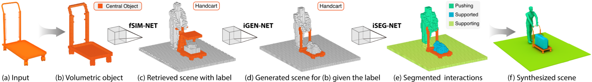

## Predictive and Generative Neural Networks for Object Functionality

### Introduction

Humans can predict the functionality of an object even without any surroundings, since their knowledge and experience would allow them to “hallucinate” the interaction or usage scenarios involving the object. In this work, we develop predictive and generative deep convolutional neural networks to replicate this feat.
PGDNN consist of three networks: **funcitonal similariity network**(fSIM-NET), **context generation network**(iGEN-NET), **segmentation network**(iSEG-NET).

Specifically, Given a 3D object in isolation, our fSIM-NET, a variation of the triplet network, is trained to predict the functionality of the object by inferring functionality-revealing interaction contexts. fSIM-NET is complemented by iGEN-NET and iSEG-NET. iGEN-NET takes a single voxelized 3D object with a functionality label and synthesizes a voxelized surround. iSEG-NET further separates the interacting objects into different groups according to their interaction types.
For more details, please refer to our [paper](http://www.cs.sfu.ca/~haoz/pubs/hu_sig18_icon4.pdf).



### Usage

In our experiment, All the codes are tested under Tensorflow 1.4 GPU version and Python 3.5 on Ubuntu 14.04.

First, please extract `label.zip`, `scene.zip`, `shape.zip` in PGDNN/Data/ folder.

To train the model of fSIM-NET, iGEN-NET, iSEG_NET, just run train.py in each folder, the model will be stored at PGDNN/Model

To predict the functionality label for an object, run PGDNN/fSIM-NET/test.py, the probabilities will be stored at PGDNN/Output/fSIM

To generate the context for the object, run PGDNN/iGEN-NET/test.py, the generated scene data will be stored at PGDNN/Output/iGEN

To segement the generated scene, run PGDNN/iSEG-net/test.py, the segmented scene data will be stored at PGDNN/Output/iSET

**Note: All the data are represented using 64 cube voxel with .mat format**

### License
Our code is released under MIT License (see LICENSE file for details).

### Citation

Please cite the paper in your publications if it helps your research:
```
@article{Hu18,
title = {Predictive and Generative Neural Networks for Object Functionality},
author = {Ruizhen Hu and Zihao Yan and Jingwen Zhan and Oliver van Kaick and Ariel Shamir and Hao Zhang and Hui Huang},
journal = {ACM Transactions on Graphics (Proc. SIGGRAPH)},
volume = {37},
number = {4},
pages = {151:1--151:14},  
year = {2018},
}
```
